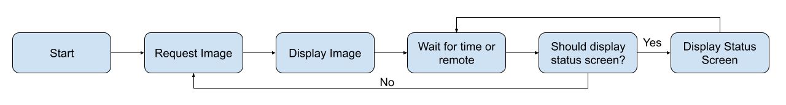
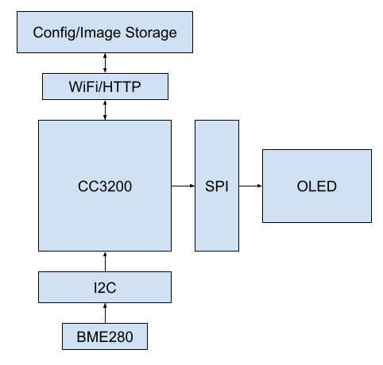

# EEC172 Final Project

## Description

For our project, we chose to implement a digital picture frame. The idea was that it could be placed in a common
area similar to a non-digital picture frame but allow internet-enabled features such as dynamically changing the
photos and order through an app and displaying information obtained from external APIS.
In terms of core features, we wanted to be able
to display a series of pictures on the SSD1351 OLED. We intended for these images to be placed on a remote computer
along with configuration information that would be exposed over HTTP that the microcontroller would then pick up
and display. We wanted to allow scrolling through the list of photos using buttons on the IR remote, in addition
to having a timer that would scroll through photos about once every 15 seconds assuming there was no user input
on the remote. We also wanted to intermittently display a status screen with information such as the current
temperature and humidity that the user might find useful.

In addition to this, we wanted to implement several additional features, such as making the order of photos
user configurable, using external APIs to display additional information such as the current weather, and allow
accepting arbitrary image sizes. We ended up implementing all of these stretch features. We did not create a nice
user interface on the server side as we wanted to focus on the embedded systems aspects of the project.

## Design

### Functional Specification



In terms of the functional specification, our design iterates through a series of states as shown in the image above. When
our program begins executing, we have an initial ordering of images. The code requests the image first in the order and then
increments the current image number. The image then gets displayed. The micrcontroller then enters a loop where it waits for
either the time limit to expire or the user to move forward or backwards using the remote. Then, if the status screen should
be displayed, the status screen is constructed and written out to the OLED. Otherwise, the program goes back to the request
image stage and begins the cycle over again. After the entire slideshow is over, the microcontroller will request the currently
specified image sequence from the server. The user can also request that the microcontroller refresh and restart the new image
sequence by pressing the last button.

### System Architecture



In terms of system architecture, we have the microcontroller and then three main protocols that we are using to communicate
with various peripherals/devices. We are using SPI to communicate with the OLED screen, where we are displaying the images.
We are using I2C to interact with the BME280 temperature/humidity sensor. Finally, we are using HTTP over WiFi to access
a remote server that contains configuration options and all of the images that will be displayed. For the remote server, we
wrote a simple Python script using the `flask` framework that will serve images when requested and also the ordering
of the images when the microcontroller enters a state where it needs to refresh that information.

## Implementation

There were several key components of our implementation that will be described below. We had to do minimal work on our circuitry
given we mostly reused circuits from the previous labs. We reused some code from previous labs but had to make significant
modifications from previous labs to get things working to the standards that we needed them at for our project.

### Physical Implementation

For the physical implementation and our circuit, we mostly used the existing circuitry built up over previous labs.
We left the OLED wired from the previous labs and used the existing circuitry for the IR remote. The only additional
circuitry that we added was for connecting the I2C temperature/humidity sensor. We used pins 1 and 2 for SCL and SDA and then
jumper wires to connect it to the breadboard. We then wired 3.3V power and GND from the OLED to the sensor and everything
worked as expected on the hardware side. We ran into some minor signal integrity issues with the SPI bus for the OLED, but
were able to rectify them in software by lowering the SPI bit rate rather than trying to fix it by making the wires shorter.

### DMA for SPI

The most complex part of our project was getting DMA working for the SPI bus. The amount of code involved was not particularly
large, but the complexity of the underlying DMA configuration and some limitations that we only found through trial and error
took a substantial amount of time to figure out. To initialize DMA, we first call the `UDMAInit()` command. Afterwards, we
do the normal SPI configuration with the `SPIConfigSetExpClk` function, but then we configure the SPI FIFOs and enable
DMA along with interrupts:

```c++
SPIConfigSetExpClk(
    GSPI_BASE,
    MAP_PRCMPeripheralClockGet(PRCM_GSPI),
    SPI_IF_BIT_RATE,SPI_MODE_MASTER,SPI_SUB_MODE_0,
     (SPI_SW_CTRL_CS |
     SPI_4PIN_MODE |
     SPI_TURBO_OFF |
     SPI_CS_ACTIVEHIGH |
     SPI_WL_8));
SPIIntRegister(GSPI_BASE,SPIisr);

SPIWordCountSet(GSPI_BASE, 32);
SPIFIFOLevelSet(GSPI_BASE, 1, 1);
SPIFIFOEnable(GSPI_BASE, SPI_RX_FIFO);
SPIFIFOEnable(GSPI_BASE, SPI_TX_FIFO);
SPIDmaEnable(GSPI_BASE, SPI_TX_DMA);
SPIDmaEnable(GSPI_BASE,SPI_RX_DMA);
SPIIntEnable(GSPI_BASE, SPI_INT_EOW);
```

We used a relatively simple ISR to keep track of when a DMA request had finished, allowing us to know when we could move on
to the next task. The ISR would simply clear the interrupts and then set a `volatile` variable called `spidone`
that could be queried in a spin-lock from elsewhere within the code. The ISR in question was implemented as the following:

```c++
volatile int spidone;

void SPIisr() {
    uint32_t status = SPIIntStatus(GSPI_BASE,true);
    SPIIntClear(GSPI_BASE,SPI_INT_EOW);
    SPIIntClear(GSPI_BASE,status);
    spidone = 1;
}
```

After setup, we then wrote a new `drawImage()` function that would take in an image buffer and write it out to the OLED
within the `Adafruit_OLED` library. We copied the command setup from the `fillScreen` function, and then used
1024 chained DMAs of 32 bytes each to transfer the 32kb of data required to write out the entire screen. The total loop that we
used looked like the following:

```c++
for (i = 0; i < 1024; ++i) {
  spidone = 0;
  UDMASetupTransfer(UDMA_CH31_GSPI_TX,UDMA_MODE_BASIC, 32,
                UDMA_SIZE_8,UDMA_ARB_1,
                image_buffer + i * 32,UDMA_SRC_INC_8,
        (void *)(GSPI_BASE + MCSPI_O_TX0),UDMA_DST_INC_NONE);
  SPICSEnable(GSPI_BASE);
  while(!spidone) {}
  SPICSDisable(GSPI_BASE);
}
```

The `UDMASetupTransfer` function initializes the DMA request. We need to call the built-in chip select enable
and disable functions or otherwise the DMA would never finish. After enabling the chip select, we enter a spin-lock where
we wait for the transfer to finish. Afterwards we disable the chip select so we can enable it again later. We can only transfer
32 bytes at a time, presumably due to that being the SPI FIFO size.

We ended up using DMA for SPI as we wanted a fast refresh rate on the OLED. While increasing the SPI bit rate improved the
user experience a decent amount, it still took about two seconds to draw over the entire screen, which was very visible from
a user perspective. We found other solutions like decreasing the image size to not be acceptable as it would significantly
impact the image quality. From our initial testing with the logic analyzer, we found that the inter-byte spacing for SPI was
quite large, suggesting that the microcontroller was not able to keep up with the SPI bus rather than the bit rate being the
bottleneck. We found some benchmarks online that shows that the transfer speed was capped to about 1MB/s without using DMA,
whereas transfer rates could be approximately 20 times higher on the CC3200 when using DMA. After implementing DMA, we saw the
inter-byte spacing drop to essentially zero on the logic analyzer and we could write out an entire frame in approximately 50ms
according to the logic analyzer, which made for a reasonably snappy user experience.

### HTTP/Networking

We had to make some modifications to the HTTP code provided in order to get things working with our setup. We ended up using
an HTTP server without any security hosted locally on a laptop rather than AWS for our implementation. This required adjusting
the code to not use any of the CC3200's hardware to encrypt/decrypt the HTTP transmissions. This was handled in the socket
initialization code which was easy enough to modify. The images that we were requesting were also 32kb in size. The
socket recieve function in the CC3200 sdk can only work with 16000 bytes at a time. Packets might also arrive after we start
reading. This means that we would have to iterate through all of the data until we hit an end of message sentinel value that
was always sent by the server. In our case, we just appended the string `endofmessage` to all of the responses that we
sent back to the microcontroller. The microcontroller would continuously call the recieve function with on the same buffer, with
an offset equal to the number of bytes already recieved, until we had recieved the entire end of message string. We set the maximum
number of bytes that we could recieve at one time to 16000, as otherwise we would get an immediate error due to the limits
mentioned previously. After these fixes, everything worked as expected and reasonably reliably, although there were sometimes
issues with some requests taking multiple seconds to fulfill. We suspect this is due to poor handling of packet loss, but we
never had time to thoroughly investigate.

### Integration

After getting all of the individual pieces working, we worked on integrating everything together. This part ended up being
relatively easy. We had to implement a timer using SysTick to implement our automatic next photo feature, use our code and wiring
from the previous lab to decode the IR buttons, and point our `drawImage` function at the buffer received over HTTP when
we ended up getting it. This did not end up taking much code and our integration ended up working pretty reliably.

## Challenges

We ran into two main challenges: getting DMA working, and getting our temperature/humidity sensor to work.
Getting DMA working was quite challenging. We found the documentation underspecified. We were able to find some examples
online of other people using DMA for SPI on the CC3200, but it took a while to understand the right flags and values to
set to get things working. First off we found we were missing a `UDMAInit()` call after maybe an hour of investigation.
It was a simple fix, but extremely easy to miss. Next, thins appeared to be partially working. When we used DMA to write data
over SPI, we could see some pixels appear on the screen, but we never seemed to be able to write more than a row or two of data.
Eventually we decided to minimize the buffer size to see if that got things fixed, and to our surprise, everything started working.
We then tried to increase the buffer size incrementally until things stopped working again. We found that we could not do a DMA
that transferred more than 32 bytes of data. Searching around online shows that we might be able to get around this if we changed
the DMA arbitration settings and changed some other flags, but we settled on just chaining 1024 DMA requests together to transfer
the 32kb of total data. It ended up being fast enough that image transitions were not very noticeable by the user.

We also ran into challenges with the I2C temperature humidity sensor. First off, we ran into issues with the pin mux config.
We copied over the configuration from an existing project, and after adding the necessary I2C configuration lines (setting up
the pins and enabling the peripheral clock), we still found that we were not sending any I2C data using the logic analyzer.
After a while we found that we were setting those pins as GPIO pins later on in the pin mux config. Removing those lines
ended up fixing the issue. Reading the sensor turned out to be reasonably challenging though due to the complexity of
interacting with the raw data. The sensor does not return the temperature or humidity directly. Instead it returns some raw
data that then needs to be plugged into specific formulas along with some calibration constants stored on the device
in order to get an actual user-meaningful value out of it. The sensor also needs to be configured in order to read anything at all,
and will otherwise return values that make sense but remain static. We did not find the datasheet particularly helpful for these
sorts of issues. We ended up using the Adafruit library designed for the BME280 as a reference, which enabled us to easily understand
what operations we needed to perform with what registers in order to get useful data out. We found another example on Github that
had a simpler configuration step that we used to figure out what registers we needed to write with that values in order to configure
the BME280 to actually take temperature and humidity measurements.

In addition to our main challenges, we also had to change the device programming on our remote to reuse our IR decoding program that utilized GPIO interrupts from Lab 3. This program was designed to decode and store values for messages transmitted in extended 32-bit NEC format, which was the protocol used by our universal remote when programmed with an assigned device code. The "MUTE" and "LAST" buttons were used in controlling the digital picture frame, but we also integrated the left and right arrow buttons. Under the default encoding, a different IR protocol was used by the remote to transmit "LEFT", "OK" or "RIGHT" button presses. By guessing and checking with a logic analyzer, we found a device code that utilized extended NEC format for all buttons used to control the picture frame. 

## Future Work

In terms of future work, we believe the biggest missing feature is a nice user interface for the web backend.
Currently images need to be uploaded manually by copying them into a specific folder with appropriate naming.
Configuration needs to be done manually by interacting with an HTTP API. Having a simple yet intuitive user interface
that would allow for changing the small number of configuration options that exist including the image order would
vastly improve the user experience. The ability to upload images would also make the entire product end-to-end easier
to use as well.

In addition, we also believe that making the hardware more resilient against network outages would be good. Currently
images are often very snappy to load, but occasionally they can take many seconds due to what we presume is packet loss.
It would be good if we could investigate this issue more thoroughly and come up with an effective plan to signal to the user
that loading is taking longer than usual along with a backoff strategy along with signaling to the user that an image failed
to load when it takes too long.

## Bill of Materials

Our bill of materials consisted mostly of items from previous labs. The only additional purchase that we made was of the
BME280 temperature/humidity sensor at \$16. We ended up using the IR remote and transciever circuitry, the CC3200 launchpad,
some dupont wires, and the 1.5" OLED. The total BOM along with costs to us is present in the table below.

## Video Demos

### Demo 1 - Demonstrates Most Functionality

<iframe src="https://www.youtube.com/embed/PcIDASCkvLE" width="800px" height="500px" allowfullscreen></iframe>

### Demo 2 - Demonstrates Automatically Changing Photos

<iframe src="https://www.youtube.com/embed/20IWaNUZKZs" width="800px" height="500px" allowfullscreen></iframe>

